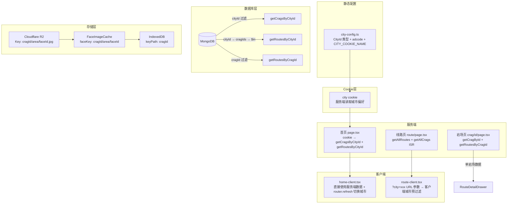
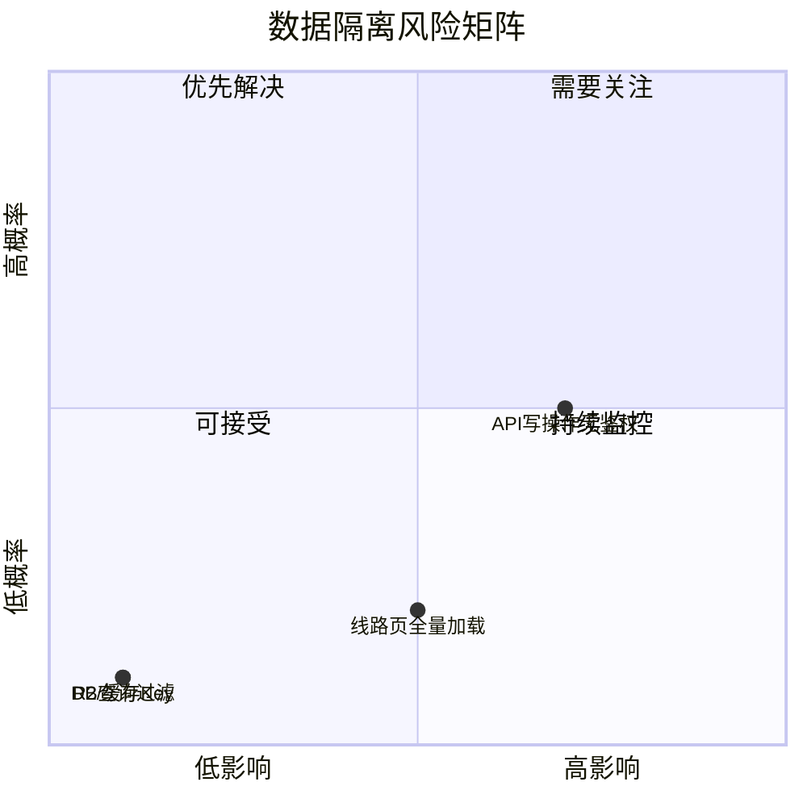

# 城市 → 岩场 → 线路 数据隔离与多城市扩展

> 分析当前数据如何在不同城市、不同岩场间隔离，以及支持更多城市时的架构改进方向。

---

## 一、当前架构总览



---

## 二、各层隔离机制详解

### 2.1 城市配置层

**文件** `src/lib/city-config.ts`

```typescript
type CityId = 'luoyuan' | 'xiamen'  // 字面量联合类型，编译时检查

interface CityConfig {
  id: CityId
  name: string
  adcode: string       // 高德地图区域码，用于天气/定位
  coordinates: Coordinates
  available: boolean   // 是否上线
}
```

| 函数/常量 | 作用 | 隔离方式 |
|-----------|------|---------|
| `getCityById(cityId)` | 获取城市配置 | 类型约束 `CityId` |
| `isValidCityId(id)` | 运行时校验 | 防止注入非法城市 |
| `getCityByAdcode(adcode)` | IP 定位反查城市 | adcode → CityId 映射 |
| `CITY_COOKIE_NAME` | Cookie 名称 (`'city'`) | 服务端读取城市偏好 |

**风险**：极低。城市为静态常量，`CityId` 类型在编译时强制约束。Cookie 值经 `isValidCityId()` 校验后使用。

---

### 2.2 数据库层

**文件** `src/lib/db/index.ts`

| 函数 | MongoDB 查询条件 | 作用域 | `cache()` |
|------|-----------------|--------|-----------|
| `getCragsByCityId(cityId)` | `{ cityId }` | 城市级 | ✅ |
| `getRoutesByCityId(cityId)` | 两步：`getCragsByCityId` → `{ cragId: { $in } }` | 城市级 | ✅ |
| `getRoutesByCragId(cragId)` | `{ cragId }` | 岩场级 | ✅ |
| `getCragById(id)` | `{ _id: id }` | 单条记录 | ✅ |
| `getRouteById(id)` | `{ _id: id }` | 单条记录 | ✅ |
| `getAllCrags()` | 无过滤 | 全局（线路页 ISR） | ✅ |
| `getAllRoutes()` | 无过滤 | 全局（线路页 ISR） | ✅ |

**隔离保证**：所有带参数的查询都通过 MongoDB 查询条件强制过滤，不可能跨岩场泄漏数据。

**`cache()` 包装**：所有查询函数均用 React `cache()` 包装，同一 RSC 请求内多次调用自动去重。`getRoutesByCityId` 内部调用 `getCragsByCityId` 也会命中缓存。

**全量查询说明**：`getAllCrags()` 和 `getAllRoutes()` 仅用于线路页（ISR 缓存），首页已改为 `getCragsByCityId` + `getRoutesByCityId` 按城市查询。

---

### 2.3 首页 — Cookie 驱动服务端城市过滤

**文件** `src/app/[locale]/page.tsx` → `home-client.tsx`

```
Server: cookies() → cityId (isValidCityId 校验，兜底 DEFAULT_CITY_ID)
  ↓
  getCragsByCityId(cityId) + getRoutesByCityId(cityId)
  ↓ props 透传 (crags, allRoutes, serverCityId)
Client: 直接使用 crags / allRoutes（无需客户端城市过滤）
  ↓
  城市切换: setCity(id) → cookie 写入 → router.refresh()
  首次 hydration: cityId !== serverCityId → 自动 router.refresh()
```

**隔离方式**：服务端 DB 查询级过滤，RSC payload 仅包含当前城市数据。

**Cookie 同步**：`use-city-selection.ts` 中 `setCity`、`init()` storedCity 分支、`init()` geoData 分支三处均同步写入 cookie（`document.cookie`），确保 localStorage 和 cookie 一致。

**ISR → 动态渲染**：`cookies()` 使页面变为动态渲染，不再需要 `revalidate`。缓解措施：PWA SW NetworkFirst 策略 + React `cache()` 请求内去重 + MongoDB 查询 < 10ms。

---

### 2.4 线路列表页 — 城市 URL 参数 + 客户端预过滤

**文件** `src/app/[locale]/route/page.tsx` → `route-client.tsx`

```
Server: getAllRoutes() + getAllCrags()  ← 全量 ISR 缓存
  ↓
Client: ?city=xxx URL 参数 → 城市预过滤 → crag/grade/search/face 过滤管线
  ↓
  cityFilteredCrags = crags.filter(c => c.cityId === selectedCity)
  cityFilteredRoutes = routes.filter(r => cragIds.has(r.cragId))
```

**设计意图**：线路页保持 ISR + 全量获取。无 `?city` 参数时显示全部城市（跨城市搜索场景）；有 `?city` 参数时客户端预过滤（从首页搜索跳转时自动携带）。

**URL 参数定义**：`FILTER_PARAMS.CITY = 'city'`（`src/lib/filter-constants.ts`）

**搜索跳转联动**：`SearchDrawer` 接收 `cityId` prop，跳转线路页时自动携带 `?city=xxx` + `?q=xxx`。

**⚠️ 多城市风险**：10+ 城市后全量加载性能下降，届时可将线路页也改为服务端城市过滤或 API 分页。

---

### 2.5 岩场详情页 — URL 级隔离

**文件** `src/app/[locale]/crag/[id]/page.tsx`

```typescript
const [crag, routes] = await Promise.all([
  getCragById(id),          // 单岩场
  getRoutesByCragId(id),    // 该岩场全部线路
])
```

**隔离方式**：URL `[id]` 参数直接作为 DB 查询条件，最强隔离。`generateStaticParams()` 预生成所有合法 ID，非法 ID → `notFound()`。

---

### 2.6 兄弟线路分组

**文件** `src/lib/route-utils.ts`

```typescript
getSiblingRoutes(route, allRoutes)
  → r.cragId === route.cragId    // 必须同岩场
  → r.faceId === route.faceId    // 必须同岩面
  → r.topoLine?.length >= 2     // 必须有 topo 数据
```

**隔离方式**：双重过滤 `cragId + faceId`，已有测试覆盖防止跨岩场泄漏（`b0a272c` commit 修复过此问题）。

---

### 2.7 API 路由

| API | 隔离方式 | 风险 |
|-----|---------|------|
| `GET /api/crags?cityId=xxx` | `isValidCityId()` + DB 过滤 | 低 |
| `GET /api/crags/[id]/routes` | URL cragId → DB 过滤 | 极低 |
| `GET /api/faces?cragId=xxx` | R2 Prefix `{cragId}/` 列举 | 低 |
| `PATCH /api/faces` | 请求体 cragId → DB + R2 | 低 |
| `POST /api/routes` | 请求体 cragId → DB 写入 | **中** ⚠️ |
| `POST /api/upload` | 请求体 cragId → R2 Key | **中** ⚠️ |

**⚠️ 写操作风险**：`POST /api/routes` 和 `POST /api/upload` 信任请求体中的 `cragId`，没有校验调用者是否有权操作该岩场。当前靠"编辑器入口只有管理员可见"保护，但无鉴权 API 是扩展的隐患。

---

### 2.8 图片缓存与存储

| 层 | Key 格式 | 隔离 |
|----|---------|------|
| R2 对象键 | `{cragId}/{area}/{faceId}.jpg` | cragId 前缀 |
| FaceImageCache | `{cragId}/{area}/{faceId}` | faceKey 含 cragId |
| IndexedDB 离线 | keyPath: `cragId` | 单岩场文档 |
| 图片 URL | `img.bouldering.top/{cragId}/...` | URL 路径 |

**隔离方式**：所有存储层的 Key 都以 `cragId` 开头，缓存失效也按 `cragId` 前缀批量操作。

---

### 2.9 天气集成

```
CityConfig.adcode → /api/weather?adcode=xxx → 高德天气 API
```

天气按城市（adcode）查询，同城市所有岩场共享天气数据。这是正确的粒度。

---

## 三、隔离风险汇总



| 风险项 | 当前状态 | 优先级 |
|--------|---------|--------|
| API 写操作无鉴权 | 靠编辑器入口控制 | 🔴 高 — 多城市/多编辑者前必须解决 |
| 线路页全量加载 | 有 `?city` 客户端预过滤，ISR 缓存 | 🟡 中 — 10+ 城市后需服务端分页 |
| ~~首页全量加载~~ | ✅ 已改为服务端城市过滤 | ✅ 已解决 |
| ~~`cityId` 向后兼容默认值~~ | 线路页 `cityFilteredCrags` 中保留 `\|\| 'luoyuan'` 兼容 | 🟢 低 |

---

## 四、多城市扩展架构改进

### 4.1 城市配置：静态 → 动态

**现状**：`CityId` 为硬编码字面量联合类型，每新增城市需改代码 + 部署。

**改进方向**：

```
阶段 1（近期）：保持静态配置，但改为数组驱动
  - CITIES_DATA 数组已支持动态扩展
  - CityId 类型自动从数组推导
  - 新增城市只需在数组中加一条记录

阶段 2（中期）：城市配置入库
  - cities 集合存入 MongoDB
  - API /api/cities 返回可用城市列表
  - 前端动态渲染城市选择器
```

**阶段 1 评估**：当前已经是数组驱动（`CityId` 从 `CITIES_DATA` 推导），新增城市改动量极小。5-10 个城市内无需入库。

---

### 4.2 数据加载：全量 → 城市分区 ✅ 已实施

**方案 A 已实施**（服务端城市过滤）：

```
首页 (动态渲染):
  cookie → cityId → getCragsByCityId(cityId) + getRoutesByCityId(cityId)
  RSC payload 仅包含当前城市数据

线路页 (ISR + 客户端预过滤):
  服务端: getAllRoutes() + getAllCrags() (ISR 缓存)
  客户端: ?city=xxx URL 参数 → cityFilteredCrags/cityFilteredRoutes
```

**已新增 DB 函数**：

```typescript
// src/lib/db/index.ts — 两步查询，cache() 去重
async function _getRoutesByCityId(cityId: string): Promise<Route[]> {
  const crags = await getCragsByCityId(cityId)  // 命中 cache()
  const cragIds = crags.map(c => c.id)
  const docs = await db.collection('routes')
    .find({ cragId: { $in: cragIds } })
    .toArray()
  return docs.map(toRoute)
}
export const getRoutesByCityId = cache(_getRoutesByCityId)
```

**后续方向（方案 B）**：10+ 城市后，线路页也改为服务端城市过滤或 API 分页 `GET /api/routes?cityId=xxx&page=1&limit=50`。

---

### 4.3 API 鉴权层

**现状**：编辑器 API（routes POST/PATCH、faces PATCH/DELETE、upload）无鉴权。

**改进方向**：

```
阶段 1（近期）：简单 API Key 校验
  - 环境变量 EDITOR_API_KEY
  - 请求头 Authorization: Bearer <key>
  - 所有写操作 API 统一检查

阶段 2（多编辑者）：用户 + 权限系统
  - 编辑者绑定 allowedCragIds
  - 中间件校验 cragId ∈ user.allowedCragIds
```

---

### 4.4 URL 路由：保持现有结构

**现状**：
```
/[locale]/crag/[id]     — 岩场详情（id 全局唯一）
/[locale]/route         — 全局线路搜索
/[locale]/route/[id]    — 线路详情
```

**评估**：`cragId` 已全局唯一（如 `yuan-tong-si`、`ba-jing-cun`），不需要 `/city/[cityId]/crag/[id]` 嵌套路由。当前 URL 结构可以支撑 50+ 城市。

---

### 4.5 R2 存储：保持现有结构

**现状**：
```
img.bouldering.top/{cragId}/{area}/{faceId}.jpg
```

**评估**：R2 Key 以 `cragId` 开头，`cragId` 全局唯一，无需加城市前缀。Cloudflare R2 单桶可支撑百万级对象，无需按城市分桶。

---

### 4.6 离线存储：保持现有结构

**现状**：IndexedDB keyPath = `cragId`，按岩场独立下载/存储。

**评估**：每个岩场独立存储，新增城市不影响已有离线数据。无需改动。

---

### 4.7 天气集成：按城市 adcode 查询

**现状**：城市配置中包含 `adcode`，天气按 adcode 查询。

**评估**：新增城市只需在配置中填入对应 adcode，天气系统自动适配。无需改动。

---

## 五、扩展改动清单

按优先级排序：

### 🔴 必须做（新增城市前）

| 改动 | 文件 | 工作量 |
|------|------|--------|
| `CITIES_DATA` 新增城市配置 | `src/lib/city-config.ts` | 5 行 |
| MongoDB 导入新城市岩场 + 线路 | `scripts/seed.ts` | 按数据量 |
| R2 上传新城市图片 | 手动或脚本 | 按图片量 |

### 🟡 建议做（5+ 城市前）

| 改动 | 文件 | 状态 |
|------|------|------|
| ~~首页服务端城市过滤~~ | `src/app/[locale]/page.tsx` | ✅ 已完成 |
| ~~新增 `getRoutesByCityId()`~~ | `src/lib/db/index.ts` | ✅ 已完成 |
| ~~线路页增加城市 URL 参数~~ | `route-client.tsx` | ✅ 已完成 |
| ~~Cookie 同步城市选择~~ | `use-city-selection.ts` + `city-config.ts` | ✅ 已完成 |
| ~~SearchDrawer 跳转携带城市~~ | `search-drawer.tsx` | ✅ 已完成 |
| API 写操作加 API Key | `src/app/api/` 多个文件 | 待实施 |
| 去除 `cityId \|\| 'luoyuan'` 向后兼容 | `route-client.tsx` | 待确认所有数据有 cityId |

### 🟢 可选做（10+ 城市时）

| 改动 | 文件 | 工作量 |
|------|------|--------|
| 城市配置入库 | 新建 `cities` 集合 + API | 中 |
| 线路 API 分页 | `/api/routes` | 中 |
| 编辑者权限系统 | 新建 `users` 集合 + 中间件 | 大 |

---

## 六、关键文件索引

| 文件 | 隔离职责 |
|------|---------|
| `src/lib/city-config.ts` | 城市定义 + 类型约束 + `CITY_COOKIE_NAME` |
| `src/lib/db/index.ts` | DB 查询级隔离（`getCragsByCityId` + `getRoutesByCityId` + cragId 过滤） |
| `src/lib/filter-constants.ts` | `FILTER_PARAMS.CITY` URL 参数常量 |
| `src/app/[locale]/page.tsx` | 首页 Cookie 驱动服务端城市过滤（动态渲染） |
| `src/app/[locale]/home-client.tsx` | 首页直接使用服务端数据 + `router.refresh()` 切换城市 |
| `src/hooks/use-city-selection.ts` | 城市选择持久化 + IP 定位 + Cookie 同步 |
| `src/app/[locale]/route/route-client.tsx` | 线路筛选管线 + `?city` URL 参数客户端预过滤 |
| `src/components/search-drawer.tsx` | 搜索跳转线路页时携带 `cityId` 参数 |
| `src/lib/route-utils.ts` | 兄弟线路 cragId 隔离 |
| `src/app/api/crags/route.ts` | 岩场 API（支持 cityId 过滤） |
| `src/app/api/faces/route.ts` | 岩面 API（R2 prefix 隔离） |
| `src/app/api/routes/route.ts` | 线路 API（**无鉴权** ⚠️） |
| `src/lib/face-image-cache/cache-service.ts` | 缓存 faceKey 含 cragId |
| `src/lib/offline-storage.ts` | 离线存储 keyPath=cragId |
